# letsChill
letsChill is a web app that allows registered users to be matched with other users with similar interests. Choose the hobbies that interest you. Search for photos and watch youtube videos on the app itself. Finally match up with other users and chat to your heart's content.

## Web Link
https://hautran1993.github.io/letsChill/

## Table of Contents
* [How To Use letsChill](#how-to-use-letschill)
* [Hobbies](#hobbies)
* [Media](#media)
* [Chat](#chat)
* [Technologies Used](#technologies-used)

# How To Use letsChill
1. When going on the landing page, you will see two buttons in the top right corner.

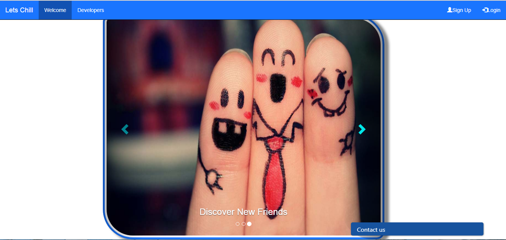

2. Click the "Sign Up" button and enter your information to register for an account.

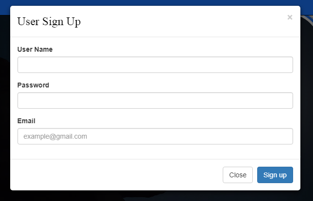

3. Once successful, click the "Login" button enter your username and password that you registered with.

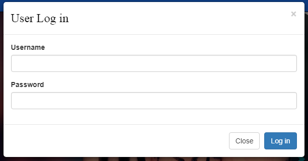

4. You will then be directed to the home page.

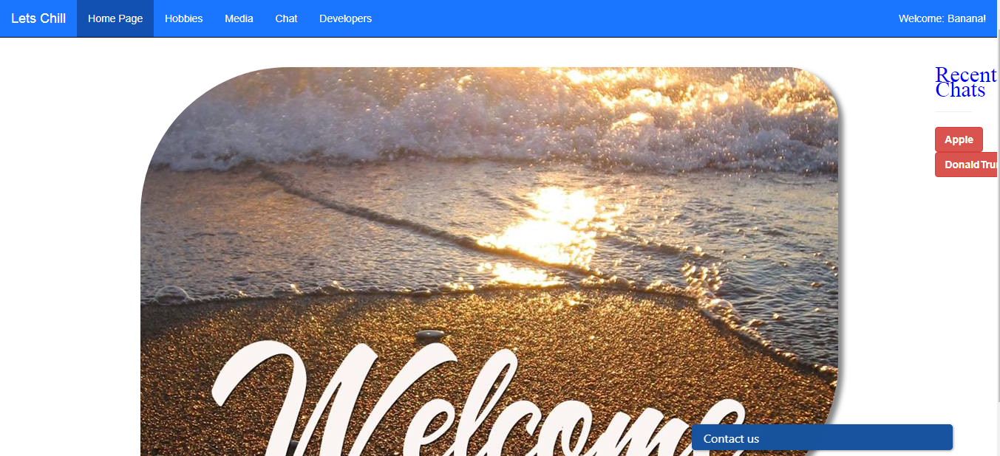

5. Click either the hobbies or media buttons on the top left of the nav bar.

## Hobbies
1. Click on the hobbies that interest you.

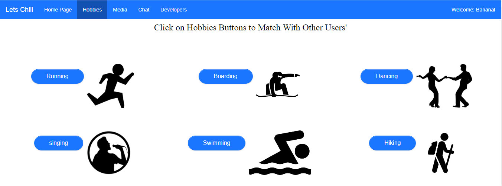

2. These hobbies will be used to compare your interests with other users.

## Media
1. Search for pictures or videos by typing into their respective input boxes and then click the "Search" button. Whatever you searched for will be used to compare your interests with other users.

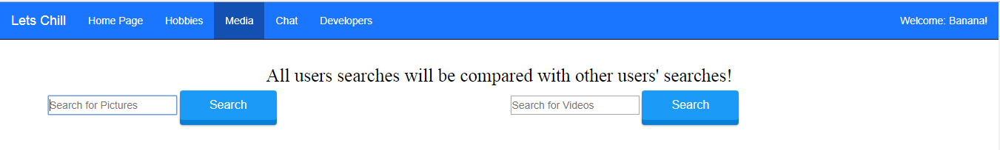

2. Pictures/videos of whatever you searched for will be displayed.

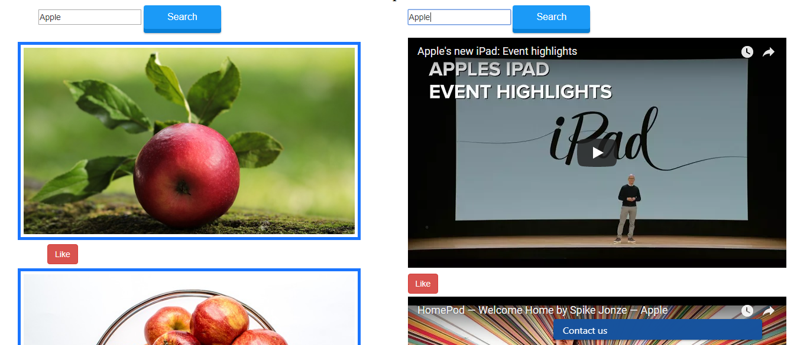

3. Click the "Like" button underneath the picture or video that you like. That picture or video will also be used to compare your interests with other users.

## Chat
1. Click the "Match" button to math yourself with other users by comparing your interests. This is dependent on if you liked any hobbies, picture, or videos.

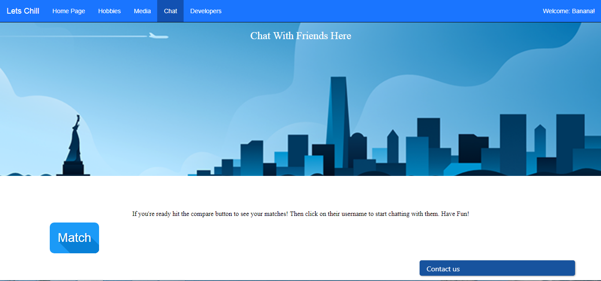

2. If there are any matches, you will see the other users' usernames.

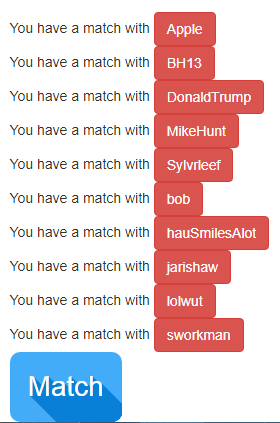

3. Click on their name to start chatting with them in real time.

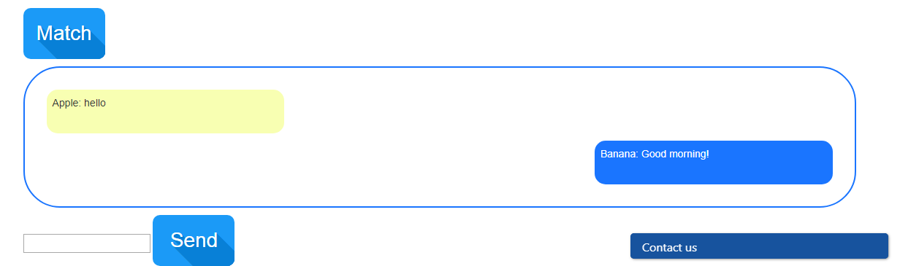

4. You can also see anyone who messaged you under "Recent Chats" on the home page.

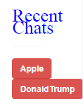

## Technologies Used
* Javascript
* jQuery
* HTML
* CSS
* Firebase